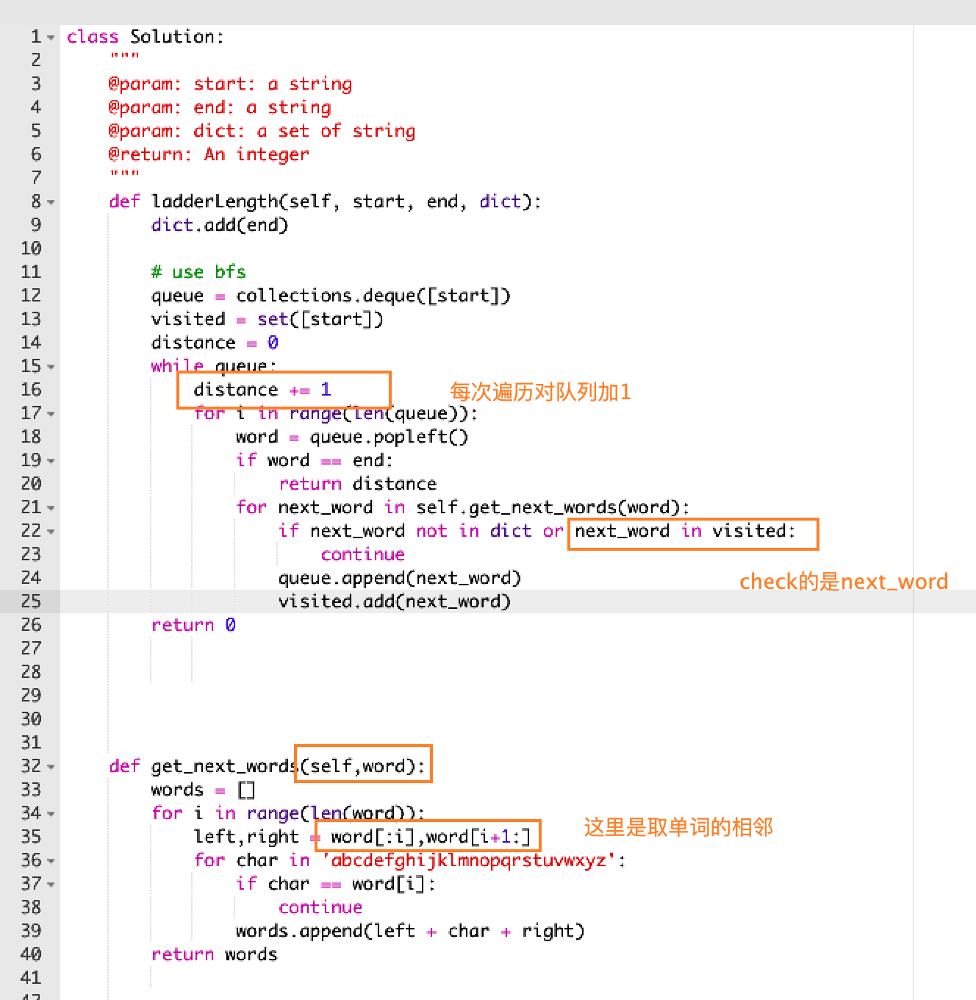

https://www.lintcode.com/problem/word-ladder/description

分层BFS
```python
class Solution:
    """
    @param: start: a string
    @param: end: a string
    @param: dict: a set of string
    @return: An integer
    """
    def ladderLength(self, start, end, dict):
        dict.add(end)
        
        # use bfs 
        queue = collections.deque([start])
        visited = set([start])
        distance = 0
        while queue:
            distance += 1
            for i in range(len(queue)):
                word = queue.popleft()
                if word == end:
                    return distance
                for next_word in self.get_next_words(word):
                    if next_word not in dict or next_word in visited:
                        continue
                    queue.append(next_word)
                    visited.add(next_word)
        return 0
                
                
        
        
        
    def get_next_words(self,word):
        words = []
        for i in range(len(word)):
            left,right = word[:i],word[i+1:]
            for char in 'abcdefghijklmnopqrstuvwxyz':
                if char == word[i]:
                    continue
                words.append(left + char + right)
        return words
            
        
        
        
        

```





```c++
class Solution {
public:
    /*
     * @param start: a string
     * @param end: a string
     * @param dict: a set of string
     * @return: An integer
     */
    int ladderLength(string &start, string &end, unordered_set<string> &dict) {
       if(start.size() == 0){
           return 0;
       }
       
       int n = start.size();
       if(n < 0 || n != end.size()){
           return 0;
       }
       
       std::queue<string> Q;
       Q.push(start);
       int length = 2;
       dict.erase(start);
       
       while(!Q.empty()){  // bfs
           int size = Q.size();
           for (int i = 0; i < size; i++) {  // 枚举start
               string word = Q.front();
               std::cout << word << std::endl;
               Q.pop();
               for (int i = 0; i < n; i++) {
                   char oldChar = word[i];
                   for (char c = 'a'; c < 'z'; c++) {  // 枚举字符 
                       if(word[i] == c){
                           continue;
                       }
                       if(word == end){
                           return length;
                       }
                       word[i] = c;
                       if(dict.find(word) != dict.end()){
                           Q.push(word);
                           dict.erase(word);
                       }
                       word[i] = oldChar;
                   }
               } // for size
             
           }
            ++length; 
       }
       return 0;
       
    }
};
```

```c++
class Solution {
public:
    /*
     * @param start: a string
     * @param end: a string
     * @param dict: a set of string
     * @return: An integer
     */
    int ladderLength(string &start, string &end, unordered_set<string> &dict) {
          if(start.size() == 0){
              return 0;
          }
          
          int n = start.size();
          if(n < 1 || n != end.size()){
              return 0;
          }
          std::queue<string> Q;
          Q.push(start);
          dict.erase(start);
          
          int length = 2;
          while(!Q.empty()){
              int size = Q.size();
              for (int i = 0; i < size; i++) {
                  string word = Q.front();
                  std::cout << word << std::endl;
                  
                  Q.pop();
                  // 枚举start中的每个字符
                  for (int i = 0; i < n; i++) {
                      char oldChar = word[i];  
                      std::cout << "oldChar: " <<oldChar<< std::endl;
                      // 枚举可以替换的26个字符
                      for (char c = 'a'; c <= 'z'; c++) {
                          if(c == word[i]){
                              std::cout << "ss" << std::endl;
                              continue;
                          }
                          
                          if(word == end){
                              std::cout << "length: " << length << std::endl;
                              return length;
                          }
                          
                          word[i] = c;
                          
                          if(dict.find(word) != dict.end()){
                              std::cout << "Q.size(): " << Q.size() << " word: " << word << std::endl;
                              Q.push(word);
                             dict.erase(word);
                          }
                      }
                      word[i] = oldChar; //放回
                  }
              } // for size
               ++length;
                std::cout << length << std::endl;
          }
          return 0;
    }
};
```