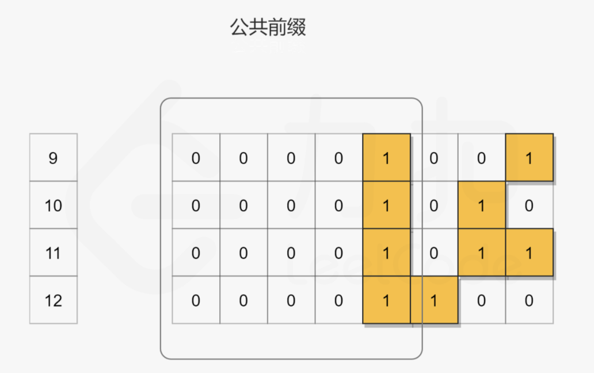

# [201. Bitwise AND of Numbers Range](https://leetcode.com/problems/bitwise-and-of-numbers-range/)

##位移

对于[m,n]，比如这里的[9,12]，对所有数字执行按位与运算的结果是所有对应二进制字符串的公共前缀再用零补上后面的剩余位。

第一个思路就是位移，将两个数字不断向右移动，直到数字相等，即数字被缩减为它们的公共前缀。然后，通过将公共前缀向左移动，将零添加到公共前缀的右边以获得最终结果。

## Brian Kernighan 算法

有个Brian Kernighan 算法用于清除二进制串中最右边的1，即n&(n-1)。可以对数字 n迭代地应用上述技巧，清除最右边的 1，直到它小于或等于 m，此时非公共前缀部分的 1 均被消去。因此最后我们返回 n即可。