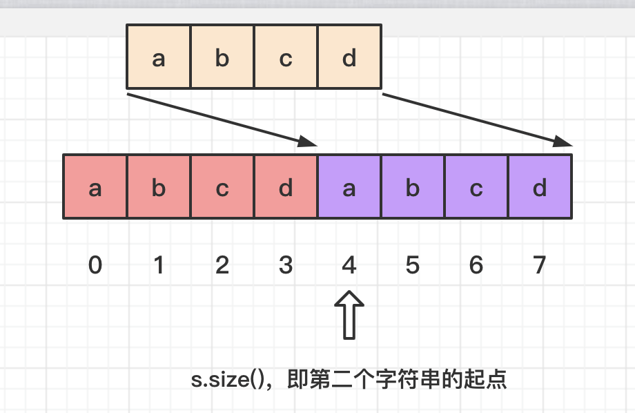
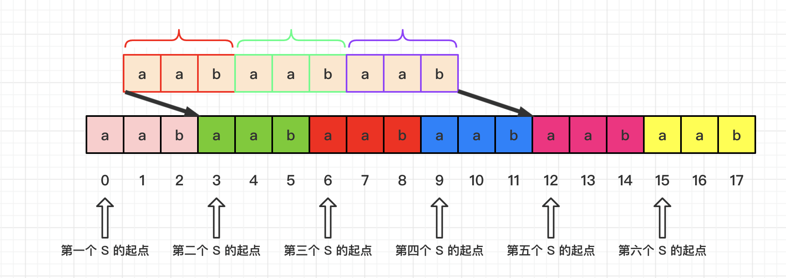

# [459. Repeated Substring Pattern](https://leetcode.com/problems/repeated-substring-pattern/)

## 字符串匹配

字符串匹配的问题可以描述为：设查询串s的的长度为 n，模式串p的长度为 m，n>m，我们需要判断模式串是否为查询串的子串。

字符串匹配中最经典的就是KMP算法。

但大部分语言自带的字符串查找函数并不是用 KMP 算法实现的。这是因为在实现 API 时，我们需要在平均时间复杂度和最坏时间复杂度二者之间权衡。普通的暴力匹配算法以及优化的 BM 算法拥有比 KMP 算法更为优秀的平均时间复杂度。

本道题的思路就是将复制s拼接成ss，

如果 s 中没有循环节，那么 ss 中必然有且只有两个 s，此时从 ss[1] 处开始寻找 s ，必然只能找到**第二个**，所以此时返回值为s.size()。

当 s 中有循环节时，设循环节为 r，其长度为 l，那么 ss 中必然有 s.size()/l + 1 个 s。
因为去掉了第一个 s 的第一个字符 (代码中，(s+s).find(s, 1)， 是从 ss[1] 处开始 find )
所以此时必回找到第二个 s 的起点。

